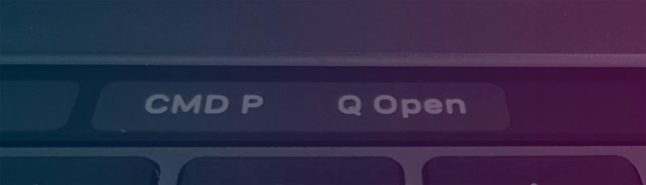

# Touchbar Command Palette 

Launch command related actions from the from the touchbar, each button can be configured to show or not.

Current list of commands include:

- Command Palette (CMD + p)
- Quick Open
- Terminal
- Sidebar

## Settings

You can choose the buttons by setting the following settings in your user settings

 "touchbarCommandPalette.commandPalette": (default _true_) Show Command Palette Button
 "touchbarCommandPalette.quickOpen": (default _true_) Show Quick Open Button
 "touchbarCommandPalette.terminal": (default _true_) Show Terminal Toggle Button
 "touchbarCommandPalette.sidebar": (default _false_) Show Sidebar Toggle Button

## Known Issues

Please report any issues via github

## Future Plans

Use Icons instead of text labels

## Release Notes

### 0.2.0

Now included abbility to show hide sidebar and terminal, slight rename to allow future helpful commands.

### 0.1.0

Now included abbility to show hide buttons

### 0.0.1

Initial release of extension

 ## Author
 [Ash Hitchcock](https://www.ashleyhitchcock.com)

 ## Contributors
Want to help imporove this plugin? See Open a pull request 😃

**Enjoy!**